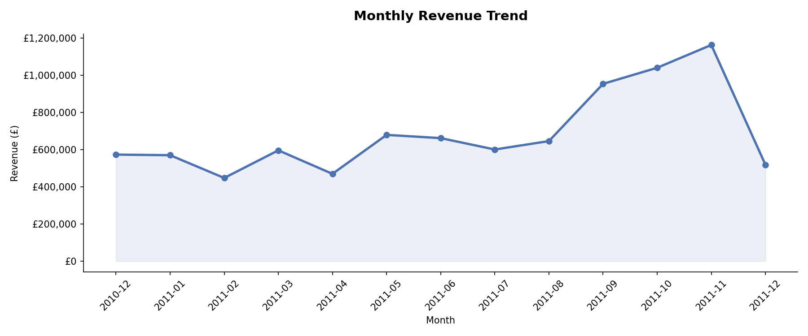
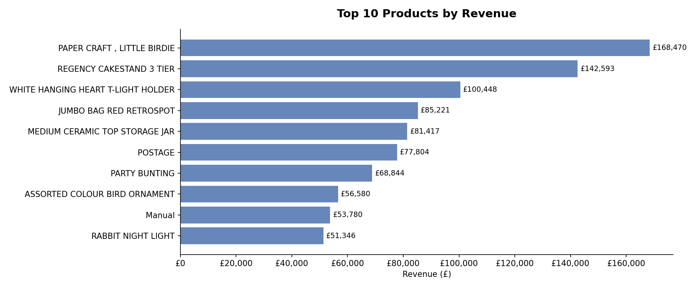
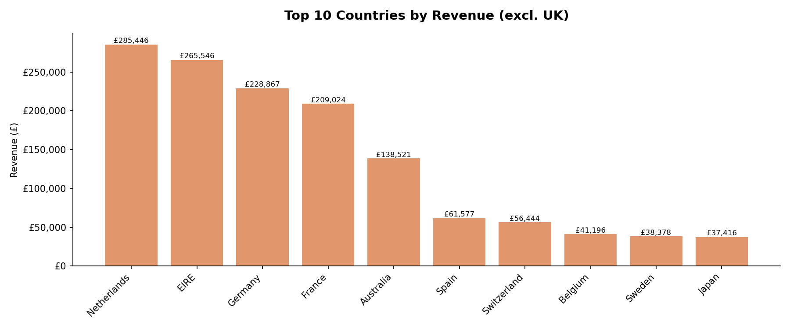
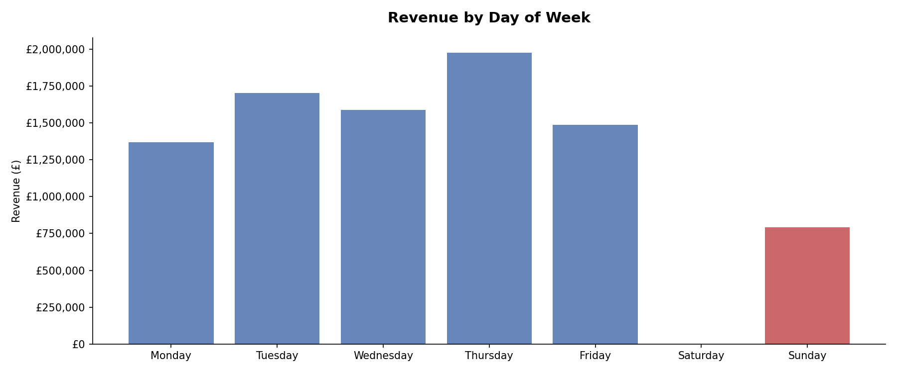
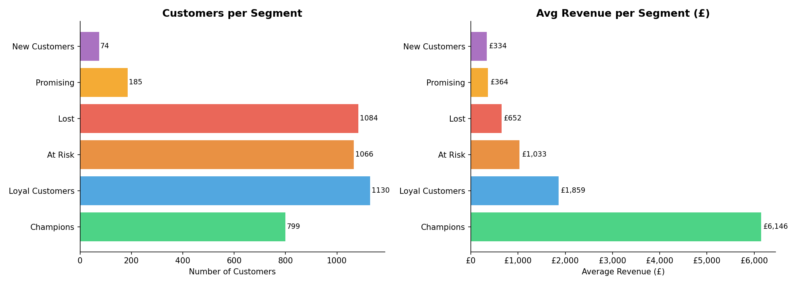
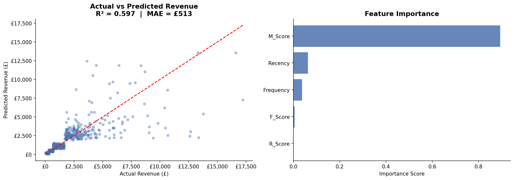

# E-Commerce Sales Analysis

End-to-end data analysis of a UK online retailer — covering data cleaning, exploratory analysis, customer segmentation (RFM), and revenue prediction using machine learning.

> **Dataset:** UCI Online Retail Dataset · 541,909 transactions · Dec 2010 – Dec 2011  
> **Tools:** Python · pandas · matplotlib · seaborn · scikit-learn · reportlab

---

## Key Results

| Metric | Value |
|---|---|
| Total revenue analysed | £8,911,407 |
| Customers segmented | 4,338 |
| Champion customers (top segment) | 799 — generate **55% of revenue** |
| At-risk revenue identified | £1.1M across 1,066 customers |
| Predictive model R² | 0.597 |
| Predictive model MAE | £512 |
## Charts







---

## Project Structure

```
ecommerce-analysis/
├── data/
│   └── online_retail.xlsx          # UCI dataset (not tracked by git)
├── notebooks/
│   ├── ecommerce_analysis.ipynb    # Main analysis notebook
│   └── generate_report.ipynb      # PDF report generator
├── reports/
│   ├── 01_monthly_revenue.png
│   ├── 02_top_products.png
│   ├── 03_top_countries.png
│   ├── 04_day_of_week.png
│   ├── 05_rfm_segments.png
│   ├── 06_model_performance.png
│   └── ecommerce_analysis_report.pdf   # Final 7-page report
├── requirements.txt
└── README.md
```

---

## Analysis Overview

### 1. Data Cleaning
- Removed 135,080 rows with missing `CustomerID`
- Filtered out cancelled orders and negative quantities/prices
- Derived `Revenue = Quantity × UnitPrice`
- Result: 397,884 clean transactions across 4,338 customers

### 2. Exploratory Analysis
- **Monthly trend:** Revenue stable at ~£580k/month early 2011, surging to £1.16M in November
- **Peak day:** Thursday (£1.97M total) — Saturday records £0 (store closed)
- **Top product:** Paper Craft, Little Birdie at £168,470
- **Top international market:** Netherlands at £285,446, outperforming Germany and France

### 3. RFM Customer Segmentation

Customers scored across Recency, Frequency, and Monetary dimensions and grouped into 6 segments:

| Segment | Customers | Revenue | % of Total |
|---|---|---|---|
| Champions | 799 | £4,911,049 | 55.1% |
| Loyal Customers | 1,130 | £2,100,164 | 23.6% |
| At Risk | 1,066 | £1,100,861 | 12.4% |
| Lost | 1,084 | £707,218 | 7.9% |
| Promising | 185 | £67,388 | 0.8% |
| New Customers | 74 | £24,728 | 0.3% |

Champions spend **9.4× more** on average than Lost customers.

### 4. Revenue Prediction Model
- Algorithm: Random Forest Regressor
- Target: Customer lifetime revenue (log-transformed to handle skew)
- R² = 0.597 · MAE = £512
- Top feature: Monetary score — past spending is the strongest predictor of future spending

---

## Business Recommendations

1. **Retain Champions** — 799 customers drive 55% of revenue. A VIP loyalty programme would protect this disproportionate contribution.
2. **Re-engage At Risk customers** — 1,066 customers averaging £1,033 in past spend. A targeted win-back campaign could recover significant revenue before they churn permanently.
3. **Expand Netherlands & EIRE** — Both outperform Germany and France. Localised campaigns could accelerate growth in these high-potential markets.
4. **Investigate Saturday closure** — Zero revenue on Saturdays is an untapped opportunity.
5. **Clean product catalogue** — Administrative items (Postage, Manual) appear in the top 10 revenue list and should be separated from physical goods.

---

## How to Run

```bash
# 1. Clone the repo
git clone https://github.com/almasi1996/ecommerce-analysis
cd ecommerce-analysis

# 2. Install dependencies
pip install -r requirements.txt

# 3. Download the dataset
# Go to: https://archive.ics.uci.edu/dataset/352/online+retail
# Save as: data/online_retail.xlsx

# 4. Run the analysis
jupyter notebook notebooks/ecommerce_analysis.ipynb

# 5. Generate the PDF report
jupyter notebook notebooks/generate_report.ipynb
```

---

## About

**Author:** Almasi
